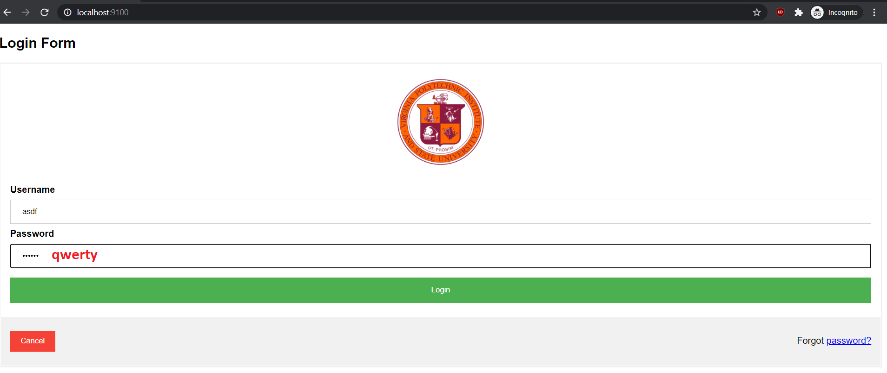
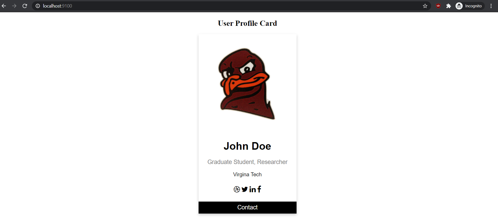
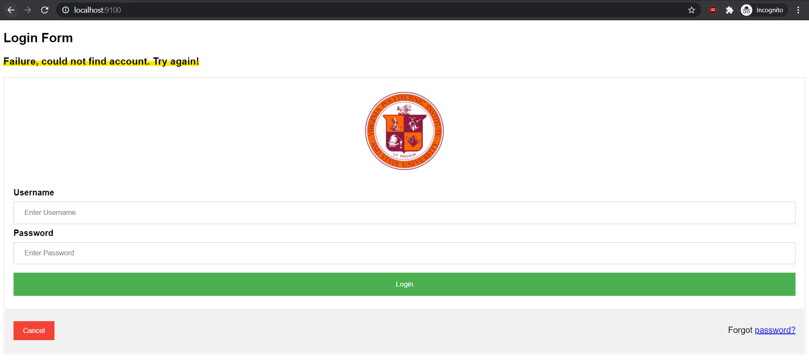
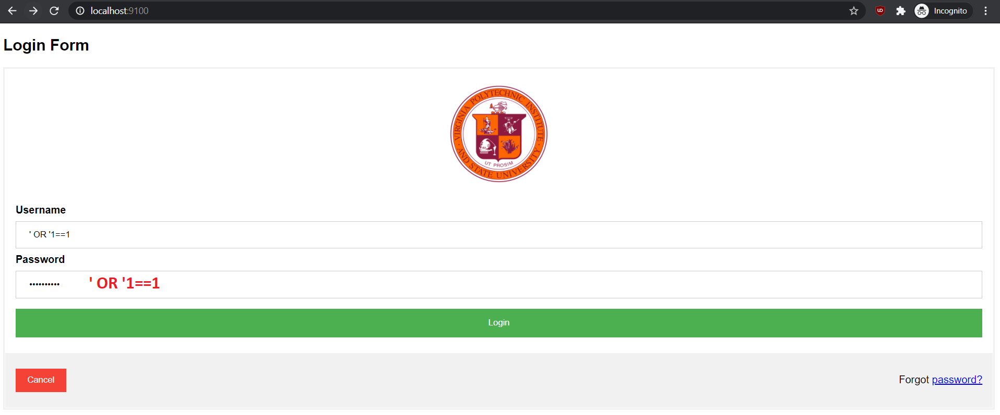

# SQL Injection

## Setup
**Dependencies**
<ul>
    <li>Python 3</li>
    <li>Node.js</li>
    <li>Express</li>
    <li>sqlite3</li>
</ul>

Install packages by typing `npm install`

**Run Server** 
`node app.js` 
Then navigate to `localhost:9100` on browser.

**Create Database** 
The database is stored as `example.sqlite` in the same directory as `app.js`  

`python3 sql_connect.py < create_tables.sql` 
Will create Users table with autoincrementing ID, fullname, username, and password columns. 

`python3 sql_connect.py < insert_entry.sql` 
Will create default user 'John Doe' with username 'asdf' and password 'qwerty'. Can edit this file for more users.  

Example SQL Injection for testing purposes is stored in `SQL_scripts/injection.sql`

## What is SQL Injection
From [OWASP](https://owasp.org/www-community/attacks/SQL_Injection)
> A SQL injection attack consists of insertion or “injection” of a SQL query via the input data from the client to the application.

At a minimum, a successful SQL injection can query information about the database and at worse it can lead to malicious update/insertion/deletion of data or even successful access to a system. Our demo showcases a login using SQL injection.

## Proof of Concept

**Normal Login**

Login to our social media network requires a username and password that is directly sent to a SQL database to verify if the entires exist in the database.

**Profile Page**

This is a sample page of a user named John Doe with the username of 'asdf' and password of 'qwerty'

**Failed Login**

If a user types in an incorrect username or password, the site will simply redirect them back to the login page with an error message.

**Login Through SQL Injection**

**Code in `routes/index.js`** 
`SELECT * FROM Users WHERE username='`+username+`' AND password='`+password+`'` 
`if (rows != undefined && rows.length > 0)`  

However, because the query to the SQL database is not properly sanitized and only checking for an existing record, we can simply input a username and password of `' OR '1==1` that will always return `TRUE` and gain access to the profile page. The resulting backend query would look like this: 
`SELECT * FROM Users WHERE username='' OR '1==1' AND password='' OR '1==1'` 

## Defense Against SQL Injection
OWASP provides a good prevention cheat sheet [here](https://cheatsheetseries.owasp.org/cheatsheets/SQL_Injection_Prevention_Cheat_Sheet.html) 

For our purposes, changing the SQL query and the condition to indicate successful login in the file `routes/index.js`. Those changes are reflected in `routes/fixed_index.js`. Simply run `node fixed_app.js` to view corrections.

**Notes**
<ul>
    <li>If login page is not updating, clear browser cache</li>
</ul>