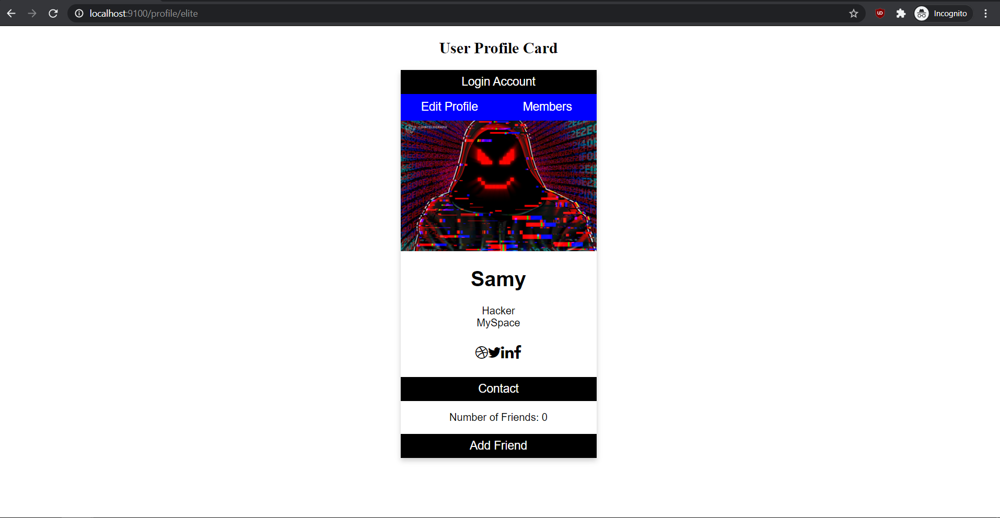

# XSS Worm

## Setup
**Dependencies**
<ul>
    <li>Python 3</li>
    <li>Node.js</li>
    <li>Express</li>
    <li>sqlite3</li>
</ul>

Install packages by typing `npm install`

**Run Server** 
`node app.js` 
Then navigate to `localhost:9100` on browser.

**Create Database** 
The database is stored as `example.sqlite` in the same directory as `app.js`  

`python3 sql_connect.py < create_tables.sql` 
Will create Users table with autoincrementing ID, fullname, username, and password columns. 

`python3 sql_connect.py < insert_entry.sql` 
Will create default user 'John Doe' with username 'asdf' and password 'qwerty'. Can edit this file for more users.  

Input for XSS Worm is stored in `exploit.txt`

## What is SQL Injection
From [Wikipedia](https://en.wikipedia.org/wiki/XSS_worm)
> An XSS worm, sometimes referred to as a cross site scripting virus, is a malicious (or sometimes non-malicious) payload, usually written in JavaScript, that breaches browser security to propagate among visitors of a website in the attempt to progressively infect other visitors.

The most famous of these XSS worms is the [Samy Worm](https://samy.pl/myspace/) where a MySpace user named Samy Kamkar forced users to add himself as a friend and claim him to be his 'hero'. The virus also applied to the victim as well, so subsequent views also infected them, resulting in a spread of about 1 million users.

## Proof of Concept

**Normal Login**

A user is given a profile page detailing their Name, Occupation, Association, and Number of Friends. Here we have Samy (the malicous attacker), and two normal user John and Alice with similar setups. Key thing to note is that each profile URL contains the user's username.  

Credentials for each user can be found in `credentials.txt`

**Samy Edit**

Each user has an option to edit their profile, but Samy here knows the backend doesn't sanitize input properly and has predictable endpoints. So Samy is able to input ``
Here, we can edit the Association entry to make it such that anybody who views the page will trigger a `POST` request to add him as a friend.

**Code to Also Make Another Profile Add Samy as a Friend**
`Hacker`
Knowing John's username based on the URL, he can make it such that he can also make John's profile add him as well. So we input the following string to our Occupation entry. A more robust exploit can make the username general, but for demo purposes we'll hard-code the user to be infected.  We can verify that John is infected because now his Association is Myspace as well

**Defense Against XSS Worms** 
OWASP provides a good prevention cheat sheet [here](https://cheatsheetseries.owasp.org/cheatsheets/Cross_Site_Scripting_Prevention_Cheat_Sheet.html) 

For our purposes, changing the `pug` file such that it doesn't allow for [unescaped string interpolation](https://pugjs.org/language/interpolation.html#string-interpolation-unescaped) and making the urls obscure more information would be enough to prevent an attacker like Samy from exploiting. Those changes are reflected in `routes/fixed_index.js` and `views/fixed_dynamic.pug`. Simply run `node fixed_app.js` to view corrections.

**Notes**
<ul>
    <li>If login page is not updating, clear browser cache</li>
</ul>